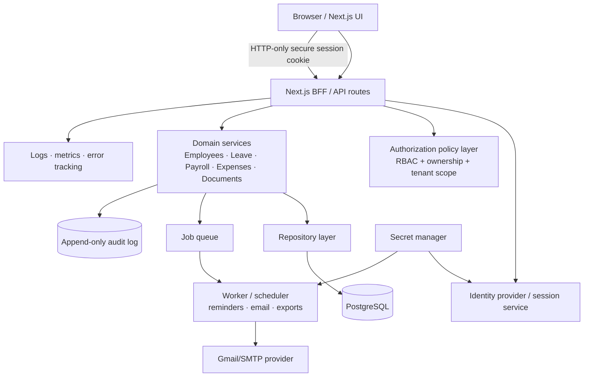

# ORB / SCOS HR — Improvement & Production-Readiness Review

**Review date:** 2026-08-09  
**Scope:** static code review, production build/type validation, configuration and API-boundary review. No product code was changed.

## Executive assessment

The application is a feature-rich HR operations prototype: employee records, attendance, leave, payroll, expenses, documents, email, lifecycle, reporting, administration, bilingual UI, Docker deployment, and local JSON persistence are present. `next build` and TypeScript compilation complete successfully.

It is **not safe to deploy with real employee or payroll data yet**. The most important gap is that authentication tokens are only base64-encoded JSON and multiple sensitive endpoints either do not authenticate the caller or do not authorize the requested action. The current storage model is also a single process-local JSON file and cannot safely support multiple application instances.

## Validation performed

| Check | Result | Notes |
|---|---|---|
| `npx tsc --noEmit` | Pass | Strict TypeScript compilation completed. |
| `npm run build` | Pass | Next.js 14.2.35 production build completed; 39 pages generated. |
| `npm run lint` | Blocked / fails CI | `next lint` launches the interactive first-time ESLint setup prompt because no ESLint configuration is committed. |
| Runtime HTTP smoke test | Inconclusive | Port 3000 was already occupied by a separate development Next server with a corrupted/stale `.next` chunk (`Cannot find module './8948.js'`). The reviewed project itself did build successfully. |
| Dependency vulnerability audit | Inconclusive | `npm audit` could not reach the npm advisory endpoint in this environment. Run this in CI with network access. |
| Automated test suite | Missing | No unit, integration, API, or browser test configuration/files were found. |

## Confirmed high-priority findings

### P0 — Do not expose real data until resolved

1. **Tokens can be forged, including as an administrator.**  
   `lib/rbac.ts` creates a token with `btoa(JSON.stringify(...))`; `decodeToken` and `middleware.ts` only decode it and compare `exp`. There is no signature, secret, issuer/audience validation, revocation, or session lookup. Any user who can construct base64 JSON can claim `role: "admin"`. This invalidates every role check that relies on `authFromRequest`.

2. **Sensitive route handlers are publicly writable once middleware accepts a token.**  
   The following handlers perform no route-level authentication or authorization:

   - `app/api/employees/[id]/route.ts`: read, update, and delete any employee.
   - `app/api/company/route.ts`: read and replace company/settings/branding data.
   - `app/api/communication/route.ts`: read all messages and create/edit/delete messages, channels, and announcements while trusting user-controlled sender IDs.
   - `app/api/documents/[id]/route.ts`: read, update, and delete documents.
   - `app/api/email/templates/[id]/route.ts`: read, update, and delete email templates.
   - `app/api/todos/[id]/route.ts`: read, update, and delete any task.
   - `app/api/email/gmail/route.ts`: reveals Gmail connection status and can connect, refresh, or disconnect the mailbox.

   Middleware proves only that a token has a future timestamp; it does not provide resource ownership checks. Every route must enforce its own authenticated principal and policy because middleware protection alone is insufficient and easy to regress.

3. **Passwords and OAuth refresh tokens are stored in plaintext.**  
   `lib/mock-data.ts` seeds literal credentials, `lib/persistence.ts` serializes user passwords and email settings to `data/db.json`, and Gmail refresh tokens are persisted in that file. `.gitignore` does not ignore `data/`, and `cookies.txt` is tracked. This is unsafe for personnel data and creates a high risk of secret leakage through version control, backups, logs, or host access.

4. **OAuth callback lacks CSRF/state protection.**  
   `app/api/email/gmail/callback/route.ts` exchanges any supplied OAuth `code`, but the authorization URL/callback flow does not establish and verify a random per-user `state`. It must bind an encrypted, short-lived state to the initiating authenticated admin and validate it on callback.

### P1 — Resolve before production rollout

5. **Data isolation is hard-coded to one demo company.**  
   Many services use `demo-company`; company identity is not derived from an authenticated tenant. This permits incorrect data access and makes a multi-company deployment unsafe.

6. **JSON persistence is not a transactional database.**  
   Writes use a single `db.json.tmp` filename and synchronous rename. Concurrent requests/processes can overwrite each other, and multiple containers each maintain different memory/cache state. There are no migrations, constraints, indexes, transactions, retention controls, or durable job execution.

7. **Authorization policy is incomplete and inconsistent.**  
   Some routes use `hasPermission`, others only check authentication, and several use neither. Employee/manager scoping exists for `GET /api/employees` but is missing for the individual employee, documents, tasks, communication, reports, payroll artifacts, and many mutation routes. Server-side policy must be the source of truth; hiding navigation or disabling modules in cookies must not determine access.

8. **Input validation is ad hoc.**  
   Most JSON handlers cast input directly to TypeScript types. TypeScript disappears at runtime, so malformed data and unwanted fields can enter the store. Use request schemas (the project already includes Zod), field allow-lists, canonical date/money validation, size limits, and predictable error responses.

9. **File upload controls are incomplete.**  
   Employee import checks filename extension but not MIME type, maximum size, workbook dimensions, formula/cell sanitization, rate limits, or batch transaction behavior. Import failures can leave a partial import. Validate and stage the batch before committing it atomically.

10. **State-changing GET behaviour exists.**  
   `GET /api/documents?type=reminders` invokes `sendExpiryReminders()`. GET must be safe/idempotent and should never enqueue notifications; make this an authorized POST or scheduled job.

11. **Operational safeguards are absent.**  
   There is no committed lint config, test suite, CI pipeline, security headers/CSP, rate limiting, structured logs, error tracking, health/readiness endpoint, backup/restore verification, or documented migration/runbook.

12. **Documentation conflicts with the implementation.**  
   `README-deploy.md` says that all data is in memory and resets on restart; Docker mounts `./data`, and `lib/persistence.ts` persists data. The deployment guide needs a clear declared storage/recovery model.

## Architecture blueprint

### Architectural rules

- **Tenant first:** derive `companyId` from the authenticated session on every request; never accept it as a trusted client field.
- **One policy boundary:** each domain command calls a common authorization helper with principal, action, resource, and tenant; policies include role *and* ownership/manager relationship.
- **Database as truth:** use PostgreSQL with Prisma/Drizzle or equivalent, migrations, foreign keys, unique constraints (email, employee ID, national ID), money as decimal/minor units, and transaction boundaries.
- **Secure identity:** use a maintained auth library/provider. Store short-lived sessions in HTTP-only, `Secure`, `SameSite` cookies; hash passwords with Argon2id; use signed JWTs only when their lifecycle is genuinely required.
- **Background work:** send email/reminders/exports through a persistent queue with retries and idempotency keys, never from a request GET handler.
- **Secrets:** retain OAuth/client secrets in a secret manager or encrypted database columns; rotate them. Do not commit data, cookie, or credential files.
- **Auditability:** immutable audit events for all HR/payroll reads and writes that include actor, tenant, action, target, timestamp, correlation ID, and before/after summary.

## Delivery plan

| Phase | Goal | Required outcomes | Exit evidence |
|---|---|---|---|
| 0. Containment | Protect current environment | Keep demo-only; remove tracked secrets/data; rotate exposed credentials; restrict deployment access | Secret scan is clean; no real PII present. |
| 1. Security foundation | Establish trusted identity and policy | Signed/session auth, Argon2id passwords, HTTP-only cookies, OAuth state/PKCE, shared route policy helper, rate limiting | Forged-token and unauthenticated-write tests fail with 401/403. |
| 2. Data foundation | Replace demo state | PostgreSQL schema/migrations, tenant model, repository layer, encrypted OAuth credentials, backup/restore | Migration and restore rehearsals pass; concurrent-write test passes. |
| 3. Domain hardening | Make HR operations correct | Zod schemas, ownership scopes, approval workflow/segregation of duties, payroll calculations/versioning, immutable audit trail | API contract/integration tests cover every permission and workflow. |
| 4. Reliability & operations | Make deployment supportable | Queue/worker, health endpoints, structured logging, monitoring, error tracking, backup alerts, runbooks | Staging load/failure drills and alert tests pass. |
| 5. Quality & delivery | Prevent regressions | ESLint configuration, unit/API/E2E tests, CI, dependency scanning, preview/staging deployments | Protected main branch requires all quality gates. |

## Minimum test matrix to add

| Level | Priority coverage |
|---|---|
| Unit | permission evaluator, token/session validation, leave/payroll rules, tenant scoping, Zod schemas, date/time and currency calculation edge cases |
| API integration | 401/403 for every route/method; admin/HR/manager/employee ownership matrix; mass assignment rejection; import size/type/atomicity; OAuth state verification |
| End-to-end | login/logout/session expiry; employee creation and approval flow; leave request-to-approval; payroll/export role limits; document expiry/reminder; Arabic and RTL critical workflows |
| Security | forged/tampered session, IDOR across tenants/employees, XSS payloads, CSRF, rate limit/brute force, secret scan, dependency audit |
| Operational | database migration, backup restore, queue retry/idempotency, service restart, concurrent update, observability alert |

## Recommended implementation order

1. Treat the repository as demo-only and remove/rotate all current credentials and persisted sensitive data.
2. Replace the base64 token implementation and secure every API route before adding new features.
3. Move state from `mock-data.ts`/JSON to a transaction-capable tenant-aware database.
4. Add the test and CI gates, then build the remaining integrations on those foundations.

## Feature completeness notes

The UI advertises several demonstration/simulated capabilities (notably billing and support); Email test send is explicitly demo mode. Confirm the product positioning: if this is an internal demo, label those boundaries prominently; if it is intended as an HRIS product, replace simulations with audited integrations and legal/compliance requirements appropriate to the target jurisdictions (for example, Saudi labor, GOSI/WPS, data residency, retention, and access-control requirements).
